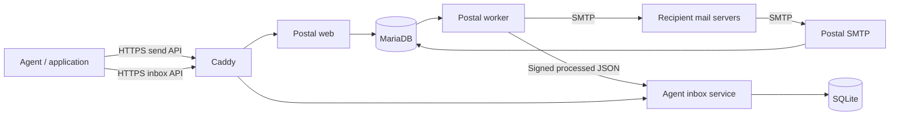

# Architecture



All services live on one Linux machine. Mail-facing components use host networking, consistent with Postal's upstream deployment pattern; the database publishes only to loopback. Web, agent inbox and metrics listeners also bind to loopback. Only SMTP 25 and Caddy 80/443 need internet ingress. SSH should be restricted by the operator.

Postal remains the authority for domains, sending credentials, outbound delivery attempts and delivery events. It provisions one message database per mail server. AgentPost's database user is restricted to `postal` and `postal-*` databases rather than having global database administrator access.

The inbox service has no runtime third-party packages. It uses Node's HTTP, crypto and SQLite APIs. Each configured inbox has a unique ID, explicit addresses and a SHA-256 bearer-token hash. Raw tokens are generated with 256 bits of randomness and only displayed when created/rotated.

Inbound deliveries are verified using RSA-SHA256 over the exact request bytes. The service accepts no externally supplied signing key or key URL. Deduplication combines inbox ID, Postal message ID, delivery token and envelope recipient. A transaction is committed before returning success. It exposes no public write/delete operation beyond scoped acknowledgement.

SQLite uses WAL and full synchronization. No claim of exactly-once agent execution is made: polling consumers must coordinate and deduplicate their own work. Replayed signed deliveries produce the same row rather than triggering agent actions directly.

Outbound HTTP requests are intentionally not auto-retried by the client because Postal's API does not provide submission idempotency. SMTP retry ownership stays with Postal. The system does not silently fail over between delivery providers.

## Boundaries

- The host administrator and Postal administrator can access all stored mail.
- Inbox tokens isolate polling access, while Postal mail servers isolate sending credentials and logs according to its permission model.
- Incoming email remains untrusted input even if its transport signature is valid. The signature proves delivery by this mail engine, not the truth of a sender's claims or instructions.
- Agent application code decides when to reply, which tools it may use, and which recipients it may contact.
- A single machine has no automatic high availability. Recovery requires backups and DNS/provider access.

## Repository layout

```text
compose.yaml       Pinned service definitions
src/inbox.mjs      Durable agent inbox API
src/client.mjs     Small sending/receiving client
scripts/           Deployment, credentials, TLS, backup and restore
examples/          Developer integration examples
tests/             Unit and real-stack integration checks
docs/              API, DNS, operations and architecture
runtime/           Generated secrets and persistent data (ignored)
```
